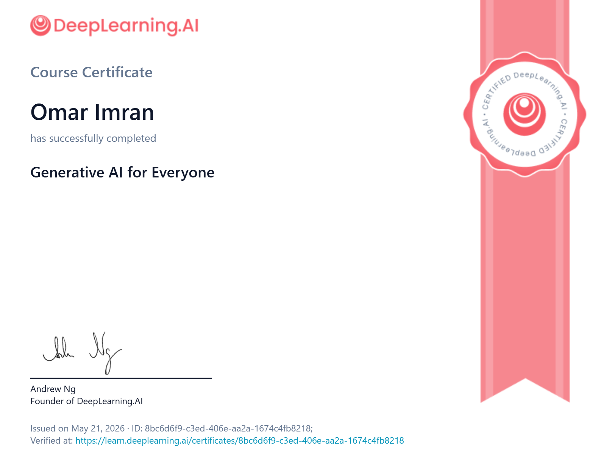

# Omar Imran AI Engineering Learning Pathway

This repository is my public AI engineering portfolio. It tracks my learning pathway, certificates, projects, reflections, and progress as I build practical skills in AI, Python, automation, evaluation, and engineering-style problem solving.

My goal is not just to collect certificates. My goal is to build evidence that I can learn technical ideas, turn them into working projects, test my work, explain my decisions, and improve over time.

## Portfolio Snapshot

- Learner: Omar Imran
- Focus: AI engineering, coding, systems thinking, and practical project building
- Foundations: Module 1 complete
- Completed build progress: Model comparison, sensor data analysis, structured extraction, deterministic tool use, and local RAG
- Current learning area: MCP, Claude Code, tools, resources, prompts, permissions, and subagents
- Current build target: Engineering MCP Toolkit
- Status: Active portfolio, growing through tested projects and honest evaluation

## What This Portfolio Shows

This repo is designed for teachers, school programs, college reviewers, scholarship reviewers, and potential internship employers who want to see real evidence of technical growth.

It includes:

- a clear AI engineering learning pathway
- completed course certificates
- project evidence and progress notes
- honest limitations and next steps
- a record of what I am learning by building

## Current Evidence

### Courses and Certificates

- DeepLearning.AI: Generative AI for Everyone
- Anthropic Academy: Claude 101
- Anthropic Academy: AI Fluency: Framework & Foundations
- Anthropic Academy: Claude Code 101
- [Anthropic Academy: Claude with the Anthropic API](certificates/anthropic-claude-with-the-anthropic-api.pdf) - completed, 85/85 lessons
- Claude Code in Action
- Introduction to subagents
- [x] Anthropic Prompt Engineering Interactive Tutorial - guided completion of all 9 main chapters and exercises; no certificate claimed
- [x] OpenAI/Codex getting-started material - completed through existing Codex desktop use and official quickstart review; no separate CLI installation required
- [x] OpenAI API Quickstart concepts - reviewed and passed a 6/6 mastery check after correction; API-key setup and a live API call were intentionally skipped
- [x] Selected OpenAI Cookbook patterns - learned repeatable requests, structured outputs, bounded retries, and evaluation; conceptual study only
- [x] MDN-style HTTP basics - reviewed requests, responses, methods, status codes, JSON bodies, timeouts, and API-key safety; passed after correction
- [x] Python foundations review - covered variables, collections, functions, files, exceptions, modules, JSON, CSV, CLI arguments, and pytest; scored 5/8 on the knowledge check and reviewed all corrections, with practical evidence in completed Python projects

Certificate files are stored in [`certificates/`](certificates/).

### Projects

| Project | Status | What It Shows |
| --- | --- | --- |
| AI Engineering Learning Pathway Portfolio | Module 1 foundations complete | Git/GitHub setup, certificate evidence, safe public portfolio structure, learning reflection |
| [Model Compare Lab](https://github.com/OMARIMI/model-compare-lab) | Complete | Same-prompt AI comparison, CLI workflow, saved cases, scoring rubric, failure handling, automated tests |
| [Sensor Data Analyzer CLI](https://github.com/OMARIMI/sensor-data-analyzer-cli) | Complete - 13/13 tests | CSV validation, configurable thresholds, deterministic statistics, JSON reports, saved/live public HTTP data, and documented success/failure demos |
| [Engineering Spec Extractor](https://github.com/OMARIMI/engineering-spec-extractor) | Built and evaluated | Structured engineering data extraction, missing-value handling with `null`, automated tests, 20-case evaluation with 93.75% field accuracy |
| [Week 5 LangChain Engineering Calculator](https://github.com/OMARIMI/week5-langchain-engineering-calculator) | Built and evaluated | Local LLM tool selection, deterministic engineering calculations, validation, audit logs, 15/15 pytest and 15/15 scenario evaluation |
| [Local Document Q&A Desktop App](https://github.com/OMARIMI/document-qa-desktop-app) | Built | PDF upload, text extraction, chunking, Ollama embeddings, ChromaDB retrieval, local answers with filename/page citations |
| Week 6 Engineering Manual RAG | Built and evaluated | Engineering-manual retrieval, hybrid semantic and keyword search, grounded answers, citations, unsupported-question handling, 15/15 saved evaluation |
| Engineering MCP Toolkit | Next/current build target | MCP server/client practice, calculator tool, component lookup, read-only resource, safe draft action, permission testing |

Project notes are tracked in [`projects/`](projects/).

## Learning Pathway

The pathway is organized around learning, building, testing, explaining, and publishing. The focus is on practical AI engineering foundations:

- Python and command-line tools
- prompt engineering and AI tool comparison
- APIs, JSON, schemas, and structured outputs
- retrieval, local models, and model evaluation
- workflow automation and agents
- safety, privacy, and failure handling
- engineering applications and capstone projects

See [`docs/learning-pathway.md`](docs/learning-pathway.md).

## Why This Matters

AI engineering is more than using chatbots. A strong builder needs to understand how systems are put together, where they fail, how to test them, and how to communicate results honestly.

This portfolio is meant to show the path from learning concepts to building real tools.

## Current Status

This portfolio is now past the original Module 2 snapshot. Omar has completed the Module 1 foundations and Module 2, including Model Compare Lab and the Sensor Data Analyzer CLI with all Builder Path checkpoints and 13/13 automated tests. He has also built and evaluated the Engineering Spec Extractor, built the Week 5 LangChain Engineering Calculator with full test and scenario passes, and completed major Week 6 RAG work.

Current work is focused on MCP and Claude Code learning. Claude Code in Action and Introduction to subagents are completed, and the next/current project target is the Engineering MCP Toolkit.

Honest limitations:

- The Engineering MCP Toolkit should not be counted as complete yet.
- Module 4 workflow and human-approval projects are not listed as complete because build evidence has not been verified.
- Some completed projects need stronger portfolio writeups, screenshots, run logs, and linked evaluation artifacts.
- Week 6 Engineering Manual RAG has a 15/15 saved evaluation, but the larger 25-question acceptance target should still be finished before calling that whole module fully closed.
- The portfolio should keep being refined as new evidence is added.

## Safety and Privacy

This repository is public. It is intended to contain learning evidence, certificates, public project notes, and portfolio materials only.

No API keys, tokens, passwords, `.env` files, private browser authentication files, or private account credentials should be committed.

## AI Assistance Disclosure

This portfolio was organized with AI assistance. I am responsible for reviewing the content, understanding the projects, testing the code, and explaining the work in my own words.
